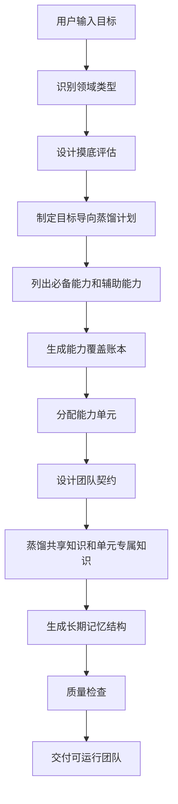
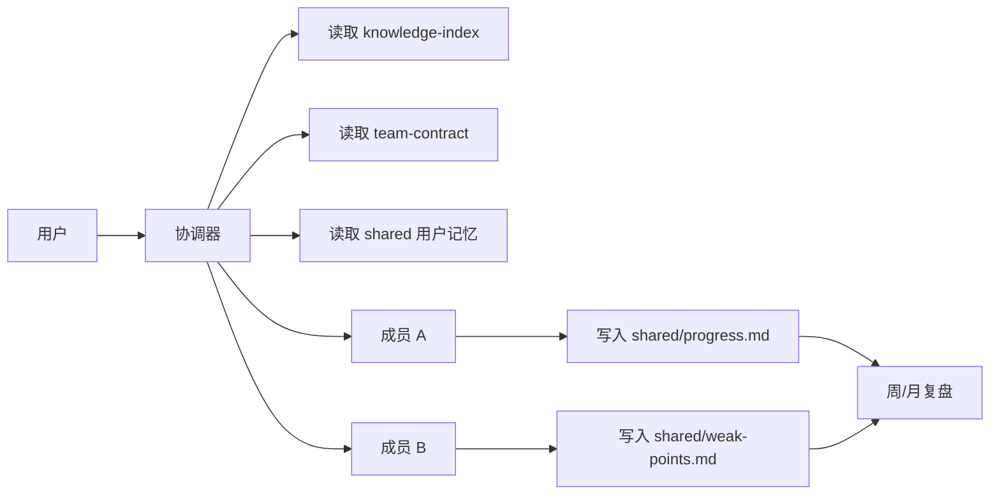

<div align="center">

# 上帝 · 造物术.skill

**把一个模糊目标，推演成一套会摸底、会蒸馏、会协作、会记忆的 AI 组织系统。**

输入一句需求，上帝会先摸清当前状态，再蒸馏领域标准、组织结构、能力方法和记忆规则，最后生成团队结构、能力单元、专业知识库、个人长期记忆、每日记录、周/月复盘和质量检查。

它不是让 AI 扮演一个助手，也不是把一群“人设”拼在一起，而是让 AI 先搭建一个能持续工作的目标系统。

[](LICENSE)
[](https://claude.ai/code)
[](SKILL.md)

</div>

---

## 一句话说明

上帝造物术是一个 **AI 组织生成器**，也是一个 **目标导向蒸馏器**。

你告诉它一个目标：

```text
我要 3 个月考研高数从 70 提到 120。
我要 46 天雅思从 6.0 到 7.0。
我要给我的猫做一个长期健康照护团队。
我要做一个内容创作流水线，每周稳定产出 5 条视频。
```

它不会只写一个“你是某某专家”的 Prompt，也不会强行把每个能力都做成人设。它会推演出：

```text
这个目标需要哪些能力？
当前用户/对象/项目的起点在哪里？
哪些能力必须有能力单元负责？
哪些单元是人，哪些是工具、流程、数据库、评估器？
每个能力单元需要哪些专业知识？
哪些知识要从网络/官方资料/用户材料里蒸馏？
哪些数据属于团队共享？
哪些数据属于某个单元专属？
哪些数据属于用户长期记忆？
每天做完任务后写入哪里？
一周后谁复盘？
一个月后谁判断策略要不要调整？
三个月后如何看到完整成长轨迹？
```

最终产物是一整个 Skill 组织目录，而不是一段提示词。

---

## 它真正生成什么

一次团队生成，理想情况下会得到这样的结构：

```text
your-team/
├── SKILL.md                         # 协调器：团队入口和总调度
├── references/                      # 团队控制面 + 共享知识库
│   ├── distillation-plan.md         # 蒸馏计划：从哪里提取标准、流程、方法
│   ├── capability-coverage.md       # 能力覆盖账本：缺谁、谁负责、一眼可查
│   ├── team-contract.md             # 团队契约：谁接什么活、写什么记忆
│   ├── knowledge-index.md           # 知识索引：什么任务读什么文件
│   ├── domain-overview.md           # 领域总览
│   ├── official-standards.md        # 官方标准/评分标准/行业规范
│   └── common-errors.md             # 常见错误/风险/反模式
├── members/                         # 每个成员都是一个独立 Skill
│   ├── role-a/
│   │   ├── SKILL.md                 # 这个角色怎么工作
│   │   └── references/              # 这个角色自己的专业知识库
│   ├── role-b/
│   │   ├── SKILL.md
│   │   └── references/
│   └── ...
└── shared/                          # 用户长期记忆和动态状态
    ├── baseline.md                  # 初始摸底：目标、起点、约束、风险
    ├── user-profile.md              # 你的目标、水平、偏好、约束
    ├── progress.md                  # 每次训练/任务/评估记录
    ├── weak-points.md               # 弱点状态机
    ├── session-log.md               # 最近 7 天会话摘要
    ├── weekly-reviews.md            # 周复盘
    ├── monthly-summary.md           # 月度总结
    └── archive/                     # 归档历史
```

这套目录就是一个可以复制、安装、迁移、版本管理的 AI 团队。

---

## 四类“数据库”怎么区分

很多人会问：每个角色都有知识和记忆，那这些数据到底放在哪里？谁能读？谁能写？

上帝的当前版本用 Markdown 文件作为轻量数据库。它不是把所有东西塞进一个大文件，而是分成四类：

| 数据层 | 存放位置 | 里面是什么 | 谁读取 | 谁写入 |
|---|---|---|---|---|
| **团队控制面** | `references/distillation-plan.md`, `references/capability-coverage.md`, `references/team-contract.md` | 蒸馏计划、团队结构、能力覆盖、路由、记忆写入规则 | 协调器、质量检查、所有成员按需 | 生成团队时写入，升级团队时修改 |
| **团队共享知识库** | `references/` | 官方标准、领域总览、通用方法论、常见错误 | 所有成员按任务读取 | 生成/更新团队时修改，日常使用不改 |
| **能力单元专属知识库** | `members/[unit]/references/` | 某个角色/工具/流程/评估器自己的评分细则、题型策略、案例库 | 对应单元为主，协调器按需读取 | 生成/更新该单元时修改 |
| **用户长期记忆库** | `shared/` | 摸底结果、用户目标、历史记录、弱点、复盘、成长轨迹 | 所有成员按需读取 | 日常使用中持续写入 |

最重要的边界：

```text
references/ 是专业知识，不记录用户隐私和日常变化。
members/*/references/ 是能力单元专业知识，不记录用户日常变化。
shared/ 是用户记忆，记录这个用户/对象/项目、这个目标、这段周期的事实。
```

所以，“不同人的数据库”在当前版本里推荐这样隔离：

```text
~/.claude/skills/ielts-team-yekai/
  shared/   ← 只记录 yekai 的雅思进度

~/.claude/skills/ielts-team-friend-a/
  shared/   ← 只记录 friend-a 的雅思进度
```

同一套团队模板可以复制多份，每份的 `shared/` 就是独立用户记忆。后续如果接后端，可以把 `shared/` 映射成：

```text
users/{user_id}/teams/{team_id}/memory
```

当前版本先用 Markdown 做轻量长期记忆，未来可以演进到 JSON、SQLite 或云端数据库。

---

## 组织是怎么从一句话长出来的

上帝不是先想“我要生成几个角色”，而是先想“这个目标需要哪些能力，当前起点在哪里，需要蒸馏哪些证据”。



如果你的阅读器不显示 Mermaid 图，可以把它理解成：

```text
目标输入 → 摸底评估 → 蒸馏计划 → 能力覆盖 → 能力单元 → 团队契约 → 知识库 → 记忆系统 → 质量检查 → 交付
```

举例：你说「启动上帝.skill，我要生成一个高数备考团队，三个月后考试」。

上帝会先判断这是考试学习型，但不会直接套雅思模板。它会继续推演：

```text
考试目标：高数提分
周期：三个月
核心任务：理解概念 + 掌握题型 + 纠错复盘 + 做套卷 + 管理节奏
评分方式：题目对错、步骤得分、速度、稳定性
长期记忆：错题类型、薄弱章节、每日练习、周测成绩、复盘策略
蒸馏对象：考试大纲、题型分类、错因体系、模拟测试方式、复习节奏
```

然后能力覆盖账本可能长这样：

| 能力模块 | 必备/辅助 | 单元形态 | 负责人 | 知识文件 | 记忆目标 |
|---|---|---|---|---|---|
| 摸底测试 | 必备 | 评估器 | baseline-evaluator | `members/baseline-evaluator/references/assessment.md` | `shared/baseline.md` |
| 概念讲解 | 必备 | 教练 | concept-coach | `members/concept-coach/references/concepts.md` | `shared/progress.md` |
| 题型训练 | 必备 | 训练流程 | problem-trainer | `members/problem-trainer/references/problem-types.md` | `shared/problem-log.md` |
| 错题复盘 | 必备 | 分析器 | error-analyst | `members/error-analyst/references/error-patterns.md` | `shared/weak-points.md` |
| 计划管理 | 必备 | 规划器 | study-planner | `members/study-planner/references/planning.md` | `shared/weekly-reviews.md` |
| 心态/执行 | 辅助 | 监督器 | accountability-monitor | `members/accountability-monitor/references/habits.md` | `shared/session-log.md` |

生成的团队可能是：

```text
高数协调器
├── 摸底评估器     ← 先测当前水平，生成 baseline
├── 概念教练       ← 讲清极限、导数、积分、级数等概念
├── 题型训练流程   ← 按题型训练：计算、证明、应用、综合题
├── 错题分析器     ← 把错题归因成知识缺口、步骤问题、计算粗心、时间问题
├── 套卷评估器     ← 负责计时训练、分数估计、考试策略
└── 学习规划器     ← 每日任务、周复盘、三个月节奏调整
```

这和雅思团队完全不同，因为能力模块不同、评分方式不同、记忆文件也不同。

---

## 三个月陪伴会怎么运行

上帝生成的团队不是一次性问答，而是围绕一个周期持续更新记忆。

以“三个月高数备考”为例：

### 第 0 天：建档和组队

用户输入：

```text
启动上帝.skill
帮我生成一个高数备考团队。我现在大概 70 分，目标 120，三个月后考试。每天能学 2 小时。
```

协调器先问：

```text
你用的是哪套考试大纲？
最近一次模考各章节错在哪里？
你更怕概念题、计算题、证明题还是综合题？
每天 2 小时里能不能保证完整计时训练？
```

然后生成：

```text
shared/user-profile.md       ← 目标 120、当前 70、三个月周期、每日 2 小时
shared/progress.md           ← 每日练习记录
shared/problem-log.md        ← 错题记录
shared/weak-points.md        ← 薄弱章节和错误模式
shared/weekly-reviews.md     ← 每周复盘
shared/monthly-summary.md    ← 月度策略调整
```

### 每天：成员各司其职

```text
用户：今天我做了 20 道导数应用题，错了 8 道。
```

协调器读取：

```text
references/team-contract.md
references/knowledge-index.md
shared/user-profile.md
shared/progress.md 最近记录
shared/weak-points.md
```

然后路由给错题分析师和题型教练：

```text
错题分析师：
  - 判断 8 道错题属于哪几类错误
  - 写入 shared/problem-log.md
  - 如果某类错误连续出现，更新 shared/weak-points.md

题型教练：
  - 根据错因给 3 组同类题训练
  - 写入 shared/progress.md

学习规划师：
  - 如果导数应用连续两天错误率 > 35%，调整本周计划
  - 写入 shared/session-log.md
```

### 每周：协调器做复盘

每周末，协调器会汇总：

```text
本周练了多少题？
哪些章节进步？
哪些错误复发？
哪些弱点从“训练中”进入“待复查”？
下周要不要调整计划？
目标 120 是否还可达？
```

写入：

```text
shared/weekly-reviews.md
```

### 每月：策略升级

月底会生成：

```text
shared/monthly-summary.md
```

它不只是总结“你很努力”，而是判断策略：

```text
极限章节已经稳定，不再每天练。
积分计算仍然不稳，下月前两周加大训练。
证明题投入产出低，如果目标是 120，可以先保基础题和中档题。
套卷速度不足，开始每周 2 次计时训练。
```

### 三个月后：完整成长轨迹

你可以追溯：

```text
最初弱点是什么？
哪些弱点真的解决了？
哪些只是熟悉题型后暂时改善？
哪几次计划调整最有效？
最终分数提升来自哪个模块？
```

这就是长期记忆的意义：不是“记住你说过什么”，而是记住**你是怎么变强的**。

---

## 多角色怎么协作

团队里每个角色不是随机发言，而是由协调器按契约调度。



协作有四条硬规则：

1. **协调器负责路由**
   用户可以只找一个入口，不需要知道该叫哪个成员。

2. **成员负责专业处理**
   写作教练只管写作，阅读教练只管阅读，高数错题分析师只管错因归类。

3. **shared 是共同记忆**
   成员不会把你的进度藏在自己的回答里，而是写回共享记忆。

4. **team-contract 负责约束行为**
   每个成员完成任务后必须知道写什么、不能写什么、何时交给谁。

---

## 创新点

| 创新点 | 说明 |
|---|---|
| **先摸底再造物** | 不直接生成团队，先评估用户/对象/项目当前状态 |
| **目标导向蒸馏** | 蒸馏的不是人设，而是领域标准、组织结构、能力方法、摸底方式和记忆结构 |
| **从需求推演组织** | 不是套固定模板，而是先分析目标需要哪些能力，再生成角色 |
| **能力覆盖账本** | 每个必备能力必须有负责人、知识文件和记忆目标，防止漏角色 |
| **团队契约** | 明确谁接任务、谁输出、谁写记忆、冲突怎么处理 |
| **成员专属知识库** | 每个角色都有自己的专业资料，不靠通用大模型临场发挥 |
| **用户长期记忆库** | `shared/` 记录目标、进度、弱点、复盘和归档 |
| **弱点状态机** | 弱点不是一句建议，而是发现→训练中→待复查→已改善→已稳定→复发 |
| **质量检查脚本** | 生成后用脚本检查团队是否完整，不靠肉眼猜 |
| **可演进存储层** | 当前 Markdown，未来可升级 JSON、SQLite、云端后端 |

---

## 先看一个真实的场景

你准备考雅思。你告诉上帝：「帮我备考雅思，目标 7 分，还有 46 天。」

上帝不会给你一个通用的「学习助手」。它会先问你几个问题：

> 上帝：你上次考了多少？哪科差最多？每天能投入多少时间？

你告诉它：上次 6.0，写作和口语最弱，每天晚上有两小时。

然后你拿到的是这个：

```
推荐团队结构（请确认或调整）：

协调器         ← 你的入口，负责路由、进度报告、周/月复盘
├── 写作教练   ← Task 1 & Task 2 批改、按4维度评分、逐句修改
├── 口语教练   ← Part 1/2/3 模拟、FC/LR/GRA/P评分、发音建议
├── 听力训练师 ← 精听方法、题型策略、Section 3/4 攻克
├── 阅读教练   ← T/F/NG诊断、定位技巧、时间管理、速度问题根因
├── 词汇监督   ← 话题词汇积累、搭配训练、测试出题
└── 学习规划师 ← 制定计划、进度追踪、模拟考安排

共享知识库：官方 Band 评分标准、中国考生常见错误、话题词汇分类
长期记忆：你的练习记录 + 弱点追踪 + 每周复盘 + 月度总结

要调整成员或开始生成吗？
```

这是上帝造物术做的事：**从你的需求推演出专属的团队**，不是套模板。

---

## 人物蒸馏 vs 系统造物

上帝和人物蒸馏型 Skill 解决的是两类问题。人物蒸馏更像提炼一个人的思维操作系统；上帝更像推演一套能协作、能记忆、能持续工作的系统。

| | 人物蒸馏型 Skill | 上帝系统型 Skill |
|---|---|---|
| **核心对象** | 一个人的心智模型和表达 DNA | 一个目标所需的角色、知识、记忆和流程 |
| **典型产物** | 单个 `SKILL.md` + 调研资料 | 协调器 + 多成员 + 共享知识库 + 长期记忆 |
| **生成逻辑** | 从材料中提炼此人怎么想 | 从目标中推演要哪些能力、谁负责、怎么协作 |
| **完整性检查** | 心智模型是否有证据 | 必备能力是否都有角色、知识和记忆承接 |
| **记忆系统** | 多为静态人格/框架 | `shared/` 持续记录用户进度、弱点和复盘 |
| **知识读取** | 按人物调研来源读取 | 按任务读取知识索引和团队契约 |

上帝在生成团队前会先做一件事：**能力覆盖检查**。它列出这个领域的必备能力，逐一确认哪个角色负责、知识文件在哪里、记忆写到哪里。如果发现必备能力没人管，必须停止并提示，而不是静默生成一个有漏洞的团队。

---

## 它和传统 Prompt/Skill 有什么不同

| | 传统 Prompt | 上帝生成的 Skill |
|---|---|---|
| **记忆** | 每次对话从零开始 | 记住你的练习记录、弱点状态、历史进度 |
| **知识** | 依赖 AI 的通用知识 | 专属知识库：官方评分标准 + 角色专属策略 |
| **输出** | 随机的自由文本 | 结构化输出，每次都有格式可预期 |
| **工作流** | 一步到位，全靠 AI 发挥 | Step-by-step，关键节点你来确认 |
| **弱点追踪** | 无 | 状态机：发现→训练中→待复查→已改善→已稳定 |
| **团队** | 一个 Prompt 一个角色 | 一次生成完整协作团队 |
| **结构** | 固定的通用模板 | 从你的需求推演出来的专属结构 |

---

## 三种造物类型

### 功能 Skill

有明确的输入→处理→输出，能调用工具，有结构化结果。

适合：代码审查、文案批改、数据分析、翻译润色……任何有专业标准的重复性任务。

### 人物 Skill

蒸馏某人的思维框架，用他的认知逻辑处理你的问题，而不只是模仿他说话。

适合：芒格的投资判断、费曼的解释方式、某个领域专家的决策框架……

### 团队 Skill

一次生成多个协同工作的角色——协调器负责路由、成员各司其职、共享知识库和记忆系统把团队连成一个整体。

适合：考试备考、健身计划、产品开发、内容创作……需要多角色配合的长期任务。

---

## 团队 Skill 实际上是什么样的

以雅思备考团队为例，看看一次完整的交互：

### 场景一：第一次练写作

```
用户      ❯ [粘贴一篇 Task 2 作文]

写作教练  ❯ ═══════════════════════════════
             写作评分 · Task 2
             题目：是否应该限制私家车
             字数：267 词
            ═══════════════════════════════

            📊 估计分数：6.0 / 9.0

            维度细分：
              TA  任务完成    6.0  立场清晰，但每个论点缺具体例子
              CC  连贯衔接    6.0  段落结构合理，主体段内部有跳跃
              LR  词汇资源    5.5  ⚠️ "good" 出现 6 次，"important" 出现 4 次
              GRA 语法准确    6.5  复杂句结构可以，从句连接偶有错误

            📝 逐段问题：

            【开头段】
              ❌ "In modern society..." → 考官最反感的套话，直接改写题目
              ⚡ "I think" → "I would argue that"（更学术，主观性更清晰）

            【主体段 1】
              ❌ "cars are very good for people"
                 → "private vehicles offer considerable convenience to commuters"
              ⚠️ 论点→解释→例子，你写了论点和解释，但没有例子
                 → 加一句："For instance, in cities like Beijing..."

            💡 最值得练的一点：LR 是你最弱的维度，也是最容易提分的。
               把"good/bad/important/nice"替换为话题词汇，
               可以直接从 5.5 → 6.5，差的只是背单词的时间。

            要看同题目的范文吗？
```

写作教练完成批改后，它会做几件事：

```
→ 追加到 shared/progress.md：
  | 2026-04-10 | 写作 | Task 2·社会 | TA:6/CC:6/LR:5.5/GRA:6.5 总:6.0 | LR停滞，词汇重复 |

→ 追加到 shared/session-log.md：
  | 2026-04-10 | 写作教练 | Task 2 批改 | 总分 6.0 | LR 三次停滞，建议专项训练 |

→ 更新 shared/weak-points.md：
  "写作 LR 词汇重复" 状态：发现 → 训练中（连续 3 次停滞，正式立案）
```

---

### 场景二：三周后协调器的周复盘

```
协调器    ❯ 第 3 周复盘 · 2026-04-07 ~ 2026-04-13

            本周练了 5 次：写作 1 / 口语 1 / 词汇 1 / 听力 2

            📊 分数变化：
            ┌──────────┬──────┬──────┬──────┐
            │ 科目      │ 上周  │ 本周  │ 变化  │
            ├──────────┼──────┼──────┼──────┤
            │ 写作      │ 6.1  │ 6.0  │ → 停滞│
            │ 口语      │ 5.8  │ 5.9  │ ↑    │
            │ 词汇正确率 │ 69%  │ 78%  │ ↑↑   │
            │ 听力      │ —    │ 训练中 │ 开始  │
            └──────────┴──────┴──────┴──────┘

            🔄 弱点状态变化：
            - 写作 CC 衔接弱：训练中 → 待复查（连续 2 次 CC ≥ 6.0 ✅）
            - 听力 Section 3/4：新发现 → 训练中
            - 口语 FC 停顿：训练中（未变化）

            ⚠️ 需要注意：
            - 写作 LR 连续三次 6.0，停滞超过 2 周，下周安排专项训练
            - 阅读至今零练习，距考试 53 天，不能再拖

            📅 下周建议（04-14 ~ 04-20）：
            1. 写作：Task 2 专项 LR 训练，目标 LR ≥ 6.5
            2. 口语：陌生话题 Part 2（验证 FC 改善是否真的有效）
            3. 听力：每天 30 分钟精听，专注角色标记
            4. 阅读：做一次摸底，评估当前水平

            已归档：本周 session-log → archive/week-03.md
```

---

### 场景三：弱点从发现到解决的完整过程

弱点不是记录下来就算了，它有自己的生命周期：

```
2026-03-30  口语教练发现：LR 词汇贫乏，大量使用 nice/good/very
            → 状态：发现 ← 在 weak-points.md 立案

2026-04-01  词汇监督制定计划：按话题系统积累，每周出一次口语词汇专练
            → 状态：训练中

2026-04-11  口语教练：LR:6.0，有进步（话题：描述一项技能）
            → 第 1 次通过

2026-04-15  口语教练：LR:6.0，稳定（话题：工作/学习）
            → 第 2 次连续通过 → 状态：待复查

2026-04-22  口语教练：LR:6.0，第 3 次通过（陌生话题验证）
            → 状态：已改善 → 协调器在周复盘中标注

2026-05-06  口语教练：LR:5.5，复发！（陌生话题压力下词汇又贫乏了）
            → 状态：复发 → 立即退回训练中
            → 词汇监督增加陌生话题专练

2026-05-20  连续 3 次 LR ≥ 6.0（包括陌生话题）
            → 状态：已稳定 ← 正式解决
```

这不是 Prompt，这是一个有记忆、有状态、会跟进的系统。

---

## 上帝如何工作（五个阶段）

### Phase 0：需求解析

判断造什么。通过 1-2 轮追问，定位你的需求——单个功能 Skill？多角色团队？人物蒸馏？

对于团队需求，上帝会识别领域类型，然后用该领域的设计问题和你对话，从你的具体答案推演出团队结构。这不是选模板，是一次设计对话。

### Phase 1：能力设计

先设计，再调研。定义每个角色的输入/输出/工具/工作流，设计团队的路由规则和数据交接方式。

### Phase 2：领域调研

按照能力设计中识别的知识需求，启动并行 Agent 调研——功能型调研行业标准，人物型调研六个维度（著作/对话/表达/决策/他者/时间线），结果全部写入 `references/research/`。

### Phase 3：Skill 构建

按四层团队架构组装：

```
团队控制面 (references/)
  distillation-plan.md    ← 蒸馏计划：标准、组织、方法、摸底、记忆从哪里来
  capability-coverage.md ← 能力覆盖账本：必备能力由谁负责
  team-contract.md       ← 团队契约：角色责任、路由、记忆写入

团队共享知识库 (references/)
  knowledge-index.md  ← 路由表：什么问题读什么文件，不一次性加载全部
  domain-overview.md  ← 领域结构
  official-standards.md  ← 官方评分标准/行业规范
  common-errors.md  ← 常见错误

成员专属知识库 (members/[role]/references/)
  每个角色自己的评分细则、策略、题型分类

用户长期记忆 (shared/)
  baseline.md        ← 摸底评估（目标、起点、约束、风险）
  user-profile.md     ← 档案（目标/水平/时间规划）
  progress.md         ← 详细练习记录
  weak-points.md      ← 弱点状态机
  session-log.md      ← 每次任务摘要，滚动 7 天
  weekly-reviews.md   ← 周复盘，滚动 4 周
  monthly-summary.md  ← 月度总结
  archive/            ← 历史归档
```

每个角色 SKILL.md 里都写明：启动时读哪些文件、完成后写哪些文件——包括 session-log 和弱点状态更新。

### Phase 4：质量验证

用真实输入测试工作流。团队模式额外测试：协调器路由是否正确、成员数据交接是否完整、共享记忆读写是否一致。

### Phase 5：交付

写入目标平台（Claude Code 或 Codex），展示使用方式，用一个样本走一遍完整流程。

---

## 安装教程

推荐安装方式尽量对齐女娲 Skill：一条命令安装，重启客户端后，用固定口令启动。

### 一键安装（推荐）

```bash
npx skills add yekaiyi62-ai/shangdi-skill
```

安装完成后，重启 Claude Code 或 Codex，让客户端重新加载 Skill 列表。

然后用固定口令启动：

```text
启动上帝.skill
```

再接你的真实需求：

```text
启动上帝.skill
我要生成一个雅思备考团队，46 天后考试，目标从 6.0 到 7.0。
```

### 指定分支安装

如果你要测试某个开发分支，可以使用 GitHub 分支路径：

```bash
npx skills add https://github.com/yekaiyi62-ai/shangdi-skill/tree/codex/explicit-shangdi-activation-install
```

如果你的 `skills` CLI 不支持 URL 分支安装，就用下面的手动方式。

### 手动安装（备用）

```bash
git clone https://github.com/yekaiyi62-ai/shangdi-skill.git
mkdir -p ~/.claude/skills/shangdi
cp -r shangdi-skill/* ~/.claude/skills/shangdi/
```

安装后，你的目录大概是：

```text
~/.claude/skills/shangdi/
├── SKILL.md
├── references/
├── templates/
├── scripts/
└── examples/
```

### 在 Claude Code 中使用

安装完成后，不要直接说“帮我生成团队”。为了避免误触发，上帝 Skill 只认一个启动口令：

```text
启动上帝.skill
```

你可以把口令和需求写在同一条消息里：

```text
启动上帝.skill
帮我生成一个雅思备考团队

启动上帝.skill
帮我做一个高数备考团队

启动上帝.skill
帮我做一个健身减脂团队

启动上帝.skill
帮我生成一个内容创作流水线

启动上帝.skill
帮我做一个代码审查 Skill
```

上帝会先判断你要的是单 Skill、人物 Skill，还是团队 Skill。团队场景会进入“领域识别 → 能力覆盖 → 团队契约 → 知识库 → 长期记忆”的生成流程。

### 第一次测试建议

如果你想验证它是不是在认真推演组织，可以用这个测试：

```text
启动上帝.skill
帮我生成一个高数备考团队。我现在 70 分，目标 120，三个月后考试，每天能学 2 小时。
```

你应该期待它先输出类似这样的内容，而不是直接开始写一堆角色：

```text
领域类型：考试学习型
核心目标：三个月内高数 70 → 120

我需要先确认：
1. 你的考试范围是否包含线代/概率，还是只有高数？
2. 最近一次模考错题主要集中在哪些章节？

初步必备能力：
- 概念讲解
- 题型训练
- 错题归因
- 套卷计时
- 计划管理

我会先生成能力覆盖账本，再生成团队契约。
```

如果它直接生成一个“数学老师 Prompt”，说明没有真正进入上帝团队模式。

### 安装雅思团队示例

```bash
cp -r shangdi-skill/examples/ielts-team ~/.claude/skills/ielts-team
```

然后在 Claude Code 中输入：

```text
帮我练雅思口语
这篇作文帮我改一下
今天练什么
看一下我的雅思进度
我阅读总是看不完，帮我诊断
```

### 质量检查

如果你修改了某个团队，可以运行：

```bash
python3 ~/.claude/skills/shangdi/scripts/quality_check.py ~/.claude/skills/ielts-team --team
```

在项目目录里开发时，也可以运行：

```bash
python3 scripts/quality_check.py examples/ielts-team --team
```

一个通过检查的团队至少要满足：

```text
能力账本存在
团队契约存在
知识索引存在
成员都有专属知识库
shared 长期记忆完整
每个成员都被路由或契约引用
必备能力都有负责人、知识文件和记忆目标
```

### 换电脑快速试用

在新电脑上执行：

```bash
npx skills add yekaiyi62-ai/shangdi-skill
```

重启 Claude Code 或 Codex 后，发送：

```text
启动上帝.skill
我要生成一个高数备考团队。我现在 70 分，目标 120，三个月后考试，每天能学 2 小时。
```

如果一键安装失败，通常是以下原因：

| 问题 | 处理 |
|---|---|
| 仓库是私有的 | 先登录 GitHub，或临时改为公开仓库 |
| `npx skills add` 不支持当前仓库格式 | 使用手动安装备用方案 |
| 安装后没有触发 | 重启 Claude Code / Codex，并确认输入了 `启动上帝.skill` |
| 想测试开发分支 | 用分支 URL 安装，或手动 clone 指定分支 |

### 其他模型怎么用

如果你不在 Claude Code 里使用，也可以把整个项目目录作为上下文或工具资料导入其他支持 Skill/Agent 文件的模型系统。

关键入口是：

```text
SKILL.md
```

其他文件不是附属摆设，而是运行资源：

```text
references/   ← 生成团队时必须读取的架构和领域规则
templates/    ← 生成 Skill 时使用的模板
scripts/      ← 质量检查工具
examples/     ← 可参考的完整团队样例
```

如果某个平台只能导入一个文件，优先导入 `SKILL.md`；如果能导入目录，必须导入整个目录，否则上帝会失去知识库、模板和质量检查能力。

---

## 在 Claude Code 中触发

上帝不会再因为普通句子自动触发。你必须先写 `启动上帝.skill`，再写目标。

```
> 启动上帝.skill
> 帮我做一个代码审查助手
→ 生成功能 Skill

> 启动上帝.skill
> 生成一个雅思备考团队
→ 生成团队（6 教练 + 协调器 + 完整知识库）

> 启动上帝.skill
> 帮我准备 CFA 1 级，6 个月后考试
→ 推演出和雅思完全不同的考试团队

> 启动上帝.skill
> 蒸馏芒格的思维方式
→ 生成人物 Skill

> 启动上帝.skill
> 帮我养好我的猫（英国短毛猫，2岁）
→ 推演出宠物照护团队

> 启动上帝.skill
> 我想提升写作能力
→ 1-2 轮追问后给出方案
```

---

## 质量检查工具

每个生成的团队都可以自检：

```bash
python3 scripts/quality_check.py path/to/team-dir --team
```

V2.2 检查项：

```
团队结构：
  ✓ distillation-plan.md 存在，且包含目标和蒸馏对象
  ✓ baseline.md 或 intake.md 存在，且包含目标和当前状态
  ✓ capability-coverage.md 存在，且必备能力都有成员/知识/记忆承接
  ✓ team-contract.md 存在，且包含角色责任/路由/记忆写入契约
  ✓ knowledge-index.md 存在且有路由表
  ✓ shared/ 下 6 个文件 + archive/ 目录齐全
  ✓ 每个成员有自己的 references/ 专属知识库
  ✓ weak-points.md 包含 6 个状态定义
  ✓ 语义覆盖：优先读取能力账本，不再写死某个领域
  ✓ 路由完整性：每个成员必须被协调器或团队契约引用

协调器：
  ✓ frontmatter / 问题路由 / 工作流步骤 / 检查点
  ✓ 输出格式规范 / 知识读取规则 / session-log 写入
  ✓ 弱点追踪 / 文件引用路径验证

每个成员：
  ✓ 以上所有 + 输入输出定义 / 能力边界 / 领域知识
```

---

## 项目结构

```
shangdi/
├── SKILL.md                              # 核心元 Skill（上帝的大脑）
├── references/
│   ├── domain-patterns.md               # 领域设计维度参考（思考工具，非固定模板）
│   ├── team-patterns.md                  # 团队编排模式
│   ├── team-knowledge-architecture.md    # 四层团队架构规范
│   └── capability-matrix.md              # Skill 能力矩阵参考
├── templates/
│   ├── functional-skill.md               # 功能 Skill 模板
│   ├── team-coordinator.md               # 协调器模板（含周/月复盘）
│   ├── person-skill.md                   # 人物 Skill 模板
│   └── codex-adapter.md                  # Codex 适配规则
├── scripts/
│   └── quality_check.py                  # V3 质量检查（蒸馏计划 + 摸底 + 能力账本 + 团队契约）
└── examples/
    └── ielts-team/                       # 完整示例：雅思备考团队（V2）
        ├── SKILL.md                      # 协调器（智能推荐 + 周/月复盘）
        ├── references/                   # 团队共享知识库
        │   ├── distillation-plan.md      #   目标导向蒸馏计划
        │   ├── capability-coverage.md    #   能力覆盖账本
        │   ├── team-contract.md          #   团队契约
        │   ├── knowledge-index.md        #   路由表
        │   ├── exam-overview.md          #   雅思结构与分数换算
        │   ├── official-rubrics.md       #   官方 Band 5-8 描述
        │   └── common-errors.md          #   中国考生常见错误
        ├── members/                      # 6 个专业教练
        │   ├── writing-coach/
        │   ├── speaking-coach/
        │   ├── listening-trainer/
        │   ├── reading-coach/            #   阅读教练（V2.1 新增）
        │   ├── vocabulary-supervisor/
        │   └── study-planner/
        └── shared/                       # 用户长期记忆（真实填充的示例数据）
            ├── baseline.md               #   初始摸底评估
            ├── user-profile.md           #   真实学员档案（目标7分/备考22天）
            ├── progress.md               #   15条练习记录（3月25日至今）
            ├── weak-points.md            #   4个当前弱点（含状态演化）+ 1个已改善
            ├── session-log.md            #   最近7天会话（4月10-16日）
            ├── weekly-reviews.md         #   3周复盘（含趋势分析和下周建议）
            ├── monthly-summary.md        #   3月月度总结
            └── archive/
```

---

## Roadmap

### 已完成

- [x] 核心元 Skill（Phase 0-5 完整流程）
- [x] 三种类型（功能/人物/团队）
- [x] 四层团队架构（控制面 / 团队共享 / 成员专属 / 用户记忆）
- [x] 目标导向蒸馏计划（领域标准 / 组织结构 / 能力方法 / 摸底 / 记忆）
- [x] 初始摸底评估（baseline）进入长期记忆系统
- [x] V2 长期记忆（session-log → 周复盘 → 月总结 → 归档）
- [x] 弱点状态机（发现→训练中→待复查→已改善→已稳定→复发）
- [x] 领域设计维度参考（推演工具，非固定模板）
- [x] Codex 平台适配
- [x] 雅思团队完整示例（含真实数据填充的 V2 长期记忆）
- [x] V3 质量检查工具（蒸馏计划 + 摸底 + 能力账本 + 团队契约）
- [x] Phase 0.8 能力覆盖检查（生成前强制验证无能力漏洞）
- [x] 雅思阅读教练（V2.1 修复：文档提到阅读但成员缺失）
- [x] V2.2 团队控制面：能力覆盖账本 + 团队契约 + 泛化质量检查
- [x] V3 目标导向蒸馏：不把所有单元都做人设，而是按目标生成能力单元
- [x] 显式启动口令：必须输入 `启动上帝.skill`，避免普通需求误触发
- [x] `npx skills add yekaiyi62-ai/shangdi-skill` 一键安装说明

### 进行中

- [ ] 更多示例：CFA 备考团队、健身团队、内容创作流水线

### 后端演进路线

Skill 系统先做扎实，存储层逐步演进：

| 版本 | 存储 | 状态 |
|------|------|------|
| V1 | 纯 Markdown | ✅ 完成 |
| V2 | Markdown + 周/月复盘 | ✅ 当前 |
| V3 | Markdown + JSON 索引（快速检索）| 规划中 |
| V4 | SQLite 本地数据库 | 规划中 |
| V5 | 运行时后端 | 远期 |

---

## Contributing

特别欢迎：

- **新示例**：用上帝生成一个团队提交到 `examples/`（附真实数据填充的 shared/）
- **新领域设计问题**：在 `references/domain-patterns.md` 补充新领域的设计维度
- **质量检查扩展**：完善 `quality_check.py`

请先开 Issue 讨论再 PR。

---

## License

MIT — 随便用，随便改，随便造。

---

<div align="center">

传统 Prompt 教 AI 怎么说。<br>
上帝教 AI 怎么做——而且记得你上次做了什么。

</div>
